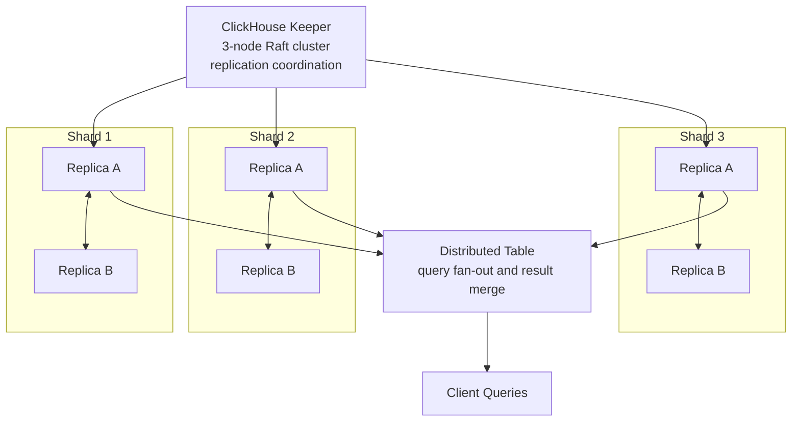
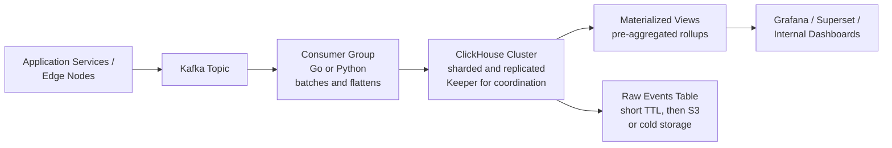

If you have spent any time around data infrastructure in the last few years, you have probably heard someone mention ClickHouse in a slightly reverent tone. Usually it goes something like "we moved our dashboards to ClickHouse and queries that took 30 seconds now take 300 milliseconds." That sentence, or some variation of it, shows up so often in engineering blogs that it has become a bit of a meme.

I had heard that same pitch for years, in conference talks, in Hacker News threads, from other engineers at meetups, without ever actually getting my hands on it. ClickHouse was always on my "should really look into this at some point" list for way too long, a list that keeps growing and growing every day. It wasn't until I recently joined Lobera Engineering that I finally got the chance to put it to work on a real workload, and this tutorial is basically the write-up of that experience.

So this is a practical, no-fluff tutorial, grounded in actually using the thing rather than just reading about it. We will cover what ClickHouse actually is, where it came from, why it is fast, when you should (and should not) reach for it, a couple of real production deployments at brutal scale, and hands-on code in Python and Go. By the end you should be able to spin up a local instance, write to it, query it, and have a mental model of how it behaves under load. Or at least, that's the theory—hopefully...

## What ClickHouse actually is

ClickHouse is an open source, column-oriented database management system built for OLAP (Online Analytical Processing) workloads. In plain terms: it is designed to answer questions like "how many requests per country did we serve last hour, broken down by status code" over billions or trillions of rows, in well under a second, without needing you to pre-aggregate anything ahead of time.

That's a very different job than what Postgres, MySQL, or YugabyteDB are optimized for. Those are OLTP (transactional) engines, built to handle thousands of small, isolated reads and writes per second with strong consistency guarantees, one row at a time. ClickHouse flips the priorities: it assumes you will insert data in big batches and mostly read it back by scanning large chunks of a few columns at once, aggregating as you go. It is not trying to be a system of record for your orders table. It is trying to be the thing you point a dashboard, a SIEM, or an analyst at.

Under the hood it is written in C++, ships as a single self-contained binary (no JVM, no external dependencies required to get started), and speaks SQL, with a dialect that is close enough to standard SQL that you will feel at home, plus a long list of analytical extensions that make life easier once you start using it seriously.

## A bit of history

ClickHouse's origin story is a good reminder that a lot of great infrastructure starts as someone solving their own very specific, very painful problem.

Back in 2009, engineers at Yandex, Russia's largest search and internet company, needed a way to generate real-time analytical reports for Yandex.Metrica, their web analytics product (roughly the Russian equivalent of Google Analytics). The catch was that they wanted reports built on the fly from raw, non-aggregated data, even while new data kept streaming in continuously. Yandex evaluated what existed at the time and didn't find anything that combined the scale, the linear horizontal scaling, and the SQL compatibility they needed, so Alexey Milovidov and a small team started building their own engine. The prototype began as something that could do fast GROUP BY operations over huge datasets, and it grew from there.

By 2011 to 2012 it was running in production powering Yandex.Metrica. The name ClickHouse is short for "Clickstream Data Warehouse," a nod to its original job of chewing through clickstream event data. Over the next several years, more teams inside Yandex adopted it for search analytics, ad systems, business intelligence, and general log processing, and the MergeTree storage engine, which is still the backbone of ClickHouse today, took shape during this period.

In [June 2016](https://clickhouse.com/blog/open-source-10), Yandex open sourced ClickHouse under the Apache 2.0 license. The response was immediate. Companies like Cloudflare were running it in production by the end of that same year. Adoption kept climbing through the following years, pulled along by word of mouth among engineers who kept posting benchmark numbers that looked almost implausible next to Elasticsearch, Postgres, or Spark for the same analytical workloads.

In September 2021, ClickHouse Inc. was formed as an independent company spun out of Yandex. Since then, the growth has been massive: from a [Series B in 2021](https://www.thesaasnews.com/news/clickhouse-raises-250-million-in-series-b-at-a-2-billion-valuation/) valuing the company at two billion dollars, to a massive [$350M Series C in late 2025](https://clickhouse.com/blog/clickhouse-raises-350-million-series-c-to-power-analytics-for-ai-era) crossing the six-billion-dollar mark. Along the way, they launched their managed cloud offering and made a string of smart acquisitions to round out the platform: Arctype for a SQL client, chDB to embed the engine as an in-process library, PeerDB for Postgres change data capture, HyperDX and LibreChat for observability and AI-assisted data access, and Langfuse for LLM observability. The open source core, though, is still the same project, still Apache 2.0, and still the thing that most people actually run.

## Why it's fast: the architecture

This is the part that actually matters if you want to use ClickHouse well instead of just running it. Most of its speed comes down to a handful of deliberate design decisions that reinforce each other.

**Columnar storage.** In a row-oriented database, each row is stored together on disk, so reading one column of a million-row table still means reading through all the other columns you don't care about. ClickHouse stores each column separately. If your query only touches three columns out of forty, ClickHouse only reads those three from disk. For analytical queries that scan huge tables but only care about a handful of fields, this alone can be a massive reduction in I/O.

**Vectorized query execution.** Instead of processing data row by row (which is what a lot of traditional query engines do internally), ClickHouse processes data in blocks, using CPU vector instructions (SIMD) to operate on many values at once. This keeps the CPU pipeline full and avoids a huge amount of per-row overhead. It is one of those things that sounds like a minor implementation detail but ends up being a large multiplier on real workloads.

**The MergeTree engine family.** This is the default and most important table engine in ClickHouse, and understanding it will save you a lot of confusion later. Data is written in sorted, immutable chunks called "parts." Every insert creates a new part; ClickHouse never rewrites existing parts in place. In the background, a merge process continuously combines smaller parts into larger ones, similar in spirit to how an LSM tree compacts data, which keeps read performance predictable even as data keeps arriving. Rows within a table are always physically sorted by whatever column or columns you choose as the `ORDER BY` (this also acts as your primary key). That sort order backs a sparse primary index: instead of indexing every single row, ClickHouse keeps a lightweight index every N rows (8192 by default), which is enough to jump close to the right place on disk and then scan a small range. That is a very different trade-off from a B-tree index in Postgres, and it is precisely why bulk analytical scans are so cheap in ClickHouse while single-row point lookups are comparatively expensive.

There is a whole family of specialized variants built on top of plain MergeTree, and picking the right one for the job matters:

- `ReplacingMergeTree`, for deduplicating rows with the same key during background merges (handy for upserts, though the dedup only happens eventually, not instantly).
- `SummingMergeTree` and `AggregatingMergeTree`, for pre-aggregating numeric columns as parts merge, which is the backbone of a lot of rollup tables.
- `CollapsingMergeTree` and `VersionedCollapsingMergeTree`, for representing row updates as insert plus cancel pairs.
- `ReplicatedMergeTree`, which adds multi-replica replication on top of any of the above.

**Compression.** Because columns store similar, sorted values next to each other, they compress extremely well; ClickHouse applies codecs like LZ4 or ZSTD by default, and lets you pick specialized codecs (delta encoding, Gorilla, and so on) per column for further gains. It is common to see ten to thirty times compression on real-world log or event data, which directly reduces both storage cost and the amount of data that has to be read off disk per query.

**Distributed by design.** A single ClickHouse node can already be fast, but production clusters usually spread data across shards for horizontal scale and across replicas for fault tolerance. Tables use `ReplicatedMergeTree` for replication, and a lightweight `Distributed` table engine sits on top as a "virtual" table that fans a query out across all shards and merges the partial results. Coordination between replicas (who has which part, quorum for inserts, and so on) used to rely on Apache ZooKeeper; more recent versions ship ClickHouse Keeper, a Raft-based coordination service built directly into the ClickHouse binary that speaks the ZooKeeper protocol but doesn't require running a separate JVM-based cluster. If you have ever operated ZooKeeper alongside Kafka, you will appreciate not needing a second one of these things around.

Here is what that looks like end to end for a small production-style cluster:



Each shard holds a slice of the data (typically hashed on some key), each shard has two or more replicas for durability, and Keeper keeps everyone honest about which parts exist where. Clients (or a load balancer in front of them) talk to the `Distributed` table, which handles fan-out and merge transparently.

## What it's good for, and what it isn't

ClickHouse shines at:

- **Real-time analytics dashboards and product analytics**, where you want ad hoc slicing and dicing over huge event tables without pre-computing every possible aggregation.
- **Observability and log analytics**, logs and traces are append-only, time-ordered, highly compressible, and exactly the shape of data MergeTree loves. Tools like SigNoz and VictoriaLogs use ClickHouse natively for this reason.
- **Security analytics and SIEM workloads**, correlating and querying enormous volumes of security events, network flow logs, and audit trails, where the ability to run ad hoc queries over months of raw data without waiting on a batch job matters a lot.
- **Time-series data**, sensor telemetry, financial tick data, IoT, anything with a timestamp and a need for fast range and aggregation queries.
- **Clickstream and behavioral analytics**, understanding how users move through a product at scale.
- **BI acceleration**, sitting behind tools like Superset or Metabase as the fast query layer, sometimes fed by CDC straight out of Postgres.

It is a poor fit for:

- **OLTP workloads.** Frequent single-row inserts, updates, deletes, and point lookups with strict transactional guarantees. Updates and deletes in ClickHouse are implemented as asynchronous, heavyweight "mutations" that rewrite whole parts in the background; they work, but they are not meant to be your hot path.
- **Storing large blobs or documents.** It is a columnar analytical engine, not an object store.
- **Systems that need strong ACID transactions across multiple tables.** That's not the problem it was built to solve.

A useful mental shortcut: if your access pattern looks like "insert a lot, read a lot of it back aggregated," ClickHouse is a great candidate. If it looks like "look up and update this one specific row, frequently, with strict consistency," reach for something else.

## Real production deployments

It's one thing to talk about theoretical performance, it's another to see what happens when a system gets hammered by real traffic for a decade.

**Cloudflare.** Cloudflare has been running ClickHouse in production since late 2016, making it one of the earliest large-scale adopters outside Yandex. It underpins HTTP analytics, DNS analytics, firewall analytics, bot management, Cloudflare Radar, and internal billing pipelines. Their [original public write-up](https://blog.cloudflare.com/http-analytics-for-6m-requests-per-second-using-clickhouse/) described a 36-node cluster with a replication factor of three, ingesting over 100 columns per HTTP request across more than 6 million requests per second on average, with peaks around 8 million. Years later, [the picture had grown enormously](https://clickhouse.com/blog/how-cloudflare-processes-hundreds-of-millions-of-rows-per-second-with-clickhouse): over 20 clusters, the largest exceeding 100 nodes, more than a thousand active replicas at points, roughly 90 million rows per second of insert throughput, and over a hundred petabytes of data under management. In [one demo](https://clickhouse.com/blog/cloudflare), a single query scanning 96 trillion events returned in under two seconds; zoomed out to a full day and 1.6 quadrillion events, it still came back in under two seconds. Cloudflare has also had to fight real production battles with the system at that scale, including [a lock contention bug in ClickHouse's query planner](https://blog.cloudflare.com/clickhouse-query-plan-contention/) triggered by runaway part counts in their billing pipeline (30,000 parts per replica growing to 160,000), which they diagnosed and fixed with upstream patches. It's a good example of what "production at scale" actually involves: not just fast queries on a good day, but understanding the internals well enough to fix them when things go sideways.

**Uber.** Uber [migrated a large chunk of their logging infrastructure](https://www.uber.com/blog/logging/) off Elasticsearch and onto ClickHouse to solve exactly the pain points a lot of teams eventually hit with ES at scale: rigid per-index schemas that break the moment your log structure changes, slow indexing, and ballooning operational cost across many clusters. Their architecture ingests logs through Kafka, flattens the JSON payloads, and stores them in ClickHouse using an array-based, schema-agnostic model so that logs with wildly different fields can live in the same table without needing a schema migration every time a developer adds a new tag. As the cluster grew to hundreds of nodes across regions, Uber split ClickHouse nodes into dedicated "query" and "data" roles: data nodes hold the actual parts, while a much smaller, mostly stateless set of query nodes handles distributed query fan-out, which made it far easier to propagate cluster topology changes and scale each role independently.

**Yandex.Metrica.** Worth a mention since it is where all of this started and is still running today. It handles more than 20 billion events a day and over 13 trillion records total, with individual clusters historically reported in the hundreds of nodes storing tens of trillions of rows and multiple petabytes of compressed data.

Beyond these three, ClickHouse (either self-hosted or via ClickHouse Cloud) shows up in production at companies like eBay, Lyft, Instacart, Shopify, Spotify, and HubSpot, generally for the same family of problems: logs, events, metrics, and dashboards that need to stay fast as the data keeps growing.

## Hands-on: get it running locally

The fastest way to try it is Docker:

```bash
docker run -d --name clickhouse-server \
  -p 8123:8123 -p 9000:9000 \
  --ulimit nofile=262144:262144 \
  clickhouse/clickhouse-server:latest
```

Port 8123 is the HTTP interface, port 9000 is the native TCP protocol (faster, used by most language drivers by default). You can immediately poke at it with the built-in client:

```bash
docker exec -it clickhouse-server clickhouse-client
```

```sql
CREATE TABLE page_views
(
    event_time DateTime,
    user_id UInt64,
    url String,
    country LowCardinality(String),
    response_time_ms UInt32
)
ENGINE = MergeTree
ORDER BY (country, event_time);
```

A couple of things worth noticing in that DDL. `LowCardinality(String)` tells ClickHouse to dictionary-encode the column, which is a big win for fields with a small set of repeating values like country codes, status codes, or log levels. And `ORDER BY (country, event_time)` is not just a sort hint, it defines the physical layout and the sparse primary index, so it should match how you actually plan to filter and aggregate.

## Python example

The official client is `clickhouse-connect`, which talks HTTP and has good pandas/Arrow integration.

```bash
pip install clickhouse-connect
```

```python
import clickhouse_connect
import random
from datetime import datetime, timedelta, timezone

client = clickhouse_connect.get_client(
    host="localhost",
    port=8123,
    username="default",
    password="",
)

client.command("""
    CREATE TABLE IF NOT EXISTS page_views
    (
        event_time DateTime,
        user_id UInt64,
        url String,
        country LowCardinality(String),
        response_time_ms UInt32
    )
    ENGINE = MergeTree
    ORDER BY (country, event_time)
""")

countries = ["ES", "US", "DE", "FR", "GB", "PT"]
urls = ["/home", "/pricing", "/docs", "/blog", "/login"]

rows = []
now = datetime.now(timezone.utc)
for i in range(50_000):
    rows.append([
        now - timedelta(seconds=random.randint(0, 86400)),
        random.randint(1, 10_000),
        random.choice(urls),
        random.choice(countries),
        random.randint(5, 800),
    ])

client.insert(
    "page_views",
    rows,
    column_names=["event_time", "user_id", "url", "country", "response_time_ms"],
)

result = client.query("""
    SELECT
        country,
        count() AS views,
        round(avg(response_time_ms), 2) AS avg_response_ms
    FROM page_views
    GROUP BY country
    ORDER BY views DESC
""")

for row in result.result_rows:
    print(row)

df = client.query_df("""
    SELECT toStartOfHour(event_time) AS hour, count() AS views
    FROM page_views
    GROUP BY hour
    ORDER BY hour
""")
print(df.head())
```

A few notes that will save you time in real usage. `client.insert()` is meant for batches, don't call it in a loop for every single row; collect rows and flush them periodically (a few thousand to tens of thousands at a time is a reasonable target). Use `parameters={}` with `{name:Type}` placeholders instead of string formatting when queries take user input, that gets you protection against injection the same way prepared statements do elsewhere. And `query_df()` is genuinely convenient when you are handing results off to pandas for further analysis or plotting.

## Go example

The official driver is `clickhouse-go`, which supports both the native binary protocol (fast, port 9000) and HTTP.

```bash
go mod init clickhouse-example
go get github.com/ClickHouse/clickhouse-go/v2
```

```go
package main

import (
    "context"
    "fmt"
    "log"
    "math/rand"
    "time"

    "github.com/ClickHouse/clickhouse-go/v2"
)

func main() {
    ctx := context.Background()

    conn, err := clickhouse.Open(&clickhouse.Options{
        Addr: []string{"127.0.0.1:9000"},
        Auth: clickhouse.Auth{
            Database: "default",
            Username: "default",
            Password: "",
        },
        Compression: &clickhouse.Compression{
            Method: clickhouse.CompressionLZ4,
        },
        DialTimeout: 10 * time.Second,
    })
    if err != nil {
        log.Fatal(err)
    }
    defer conn.Close()

    if err := conn.Ping(ctx); err != nil {
        log.Fatal("ping failed: ", err)
    }

    err = conn.Exec(ctx, `
        CREATE TABLE IF NOT EXISTS page_views
        (
            event_time DateTime,
            user_id UInt64,
            url String,
            country LowCardinality(String),
            response_time_ms UInt32
        )
        ENGINE = MergeTree
        ORDER BY (country, event_time)
    `)
    if err != nil {
        log.Fatal(err)
    }

    batch, err := conn.PrepareBatch(ctx, "INSERT INTO page_views")
    if err != nil {
        log.Fatal(err)
    }

    countries := []string{"ES", "US", "DE", "FR", "GB", "PT"}
    urls := []string{"/home", "/pricing", "/docs", "/blog", "/login"}
    now := time.Now()

    for i := 0; i < 50_000; i++ {
        err := batch.Append(
            now.Add(-time.Duration(rand.Intn(86400))*time.Second),
            uint64(rand.Intn(10_000)+1),
            urls[rand.Intn(len(urls))],
            countries[rand.Intn(len(countries))],
            uint32(rand.Intn(800)+5),
        )
        if err != nil {
            log.Fatal(err)
        }
    }

    if err := batch.Send(); err != nil {
        log.Fatal(err)
    }

    rows, err := conn.Query(ctx, `
        SELECT
            country,
            count() AS views,
            round(avg(response_time_ms), 2) AS avg_response_ms
        FROM page_views
        GROUP BY country
        ORDER BY views DESC
    `)
    if err != nil {
        log.Fatal(err)
    }
    defer rows.Close()

    for rows.Next() {
        var (
            country         string
            views           uint64
            avgResponseTime float64
        )
        if err := rows.Scan(&country, &views, &avgResponseTime); err != nil {
            log.Fatal(err)
        }
        fmt.Printf("%s: %d views, %.2fms avg\n", country, views, avgResponseTime)
    }
    if err := rows.Err(); err != nil {
        log.Fatal(err)
    }
}
```

The pattern here, `PrepareBatch` then `Append` in a loop then `Send`, is the idiomatic way to do bulk inserts with the native protocol. It buffers rows client-side and ships them to the server as a single compressed block, which is exactly the kind of write pattern MergeTree is designed around. If you are doing extremely high-throughput ingestion (millions of rows per second) and want to shave off every bit of overhead, ClickHouse also offers a lower-level `ch-go` client that skips the row-to-column pivoting `clickhouse-go` does internally, at the cost of a less friendly API.

## A system design example: a real-time ingestion pipeline

Putting the pieces together, here's a fairly typical shape for a production pipeline feeding ClickHouse, similar in spirit to what Cloudflare and Uber both described in their own write-ups, just at a saner scale:



The important design decisions in a pipeline like this:

- **Kafka (or another durable queue) sits in front of ClickHouse**, decoupling producers from ClickHouse availability and giving you a buffer to replay from if a batch job fails or a node needs maintenance.
- **Consumers batch before inserting.** This is the single most important operational rule with MergeTree tables. Every insert creates a new part; too many small inserts create too many small parts, which increases merge pressure, Keeper metadata load, and eventually query latency. Batch sizes in the thousands to tens of thousands of rows, flushed every few seconds, are a common sweet spot. If your producers genuinely can't batch client-side, ClickHouse's server-side async insert setting lets the server do the batching for you at the cost of slightly delayed durability.
- **Materialized views handle rollups incrementally**, as new parts land in the raw table, ClickHouse can automatically push aggregated results into a summary table using `AggregatingMergeTree` or `SummingMergeTree`, so your dashboards query a much smaller, pre-aggregated table instead of re-scanning raw events every time someone refreshes a screen.
- **TTL clauses manage the lifecycle of raw data.** You typically don't want to keep every raw event forever at full resolution; a `TTL` clause on the table can automatically drop old raw rows after N days, or move them to cheaper, slower storage (including S3-backed disks) while newer, hot data stays on fast local disks.

## Production gotchas worth knowing before you get burned

A short list of things that separate "it worked in the demo" from "it survived a year of real traffic":

- **Don't do single-row inserts in a hot loop.** Batch client-side, or lean on async inserts. This is the number one mistake people make coming from an OLTP mindset.
- **Choose your `ORDER BY` deliberately, and don't change your mind later without a plan.** It defines both the physical sort order on disk and your primary index. Match it to your most common filter and aggregation patterns (Cloudflare's own default pattern, for example, sorts by a namespace and index identifier before timestamp for exactly this reason).
- **Avoid `FINAL` on the hot path.** It forces ClickHouse to merge and deduplicate at query time instead of relying on background merges, which can be significantly slower under load.
- **Watch your part count.** If ingestion outpaces background merges for long enough, you accumulate too many parts, which degrades query planning and stresses the coordination layer. [This is exactly what bit Cloudflare's billing pipeline](https://blog.cloudflare.com/clickhouse-query-plan-contention/).
- **Updates and deletes are not free.** They exist (`ALTER TABLE ... UPDATE/DELETE` as asynchronous mutations, or `ReplacingMergeTree`/`CollapsingMergeTree` patterns for a more "native" approach), but treat them as occasional maintenance operations, not a request-path pattern.
- **Give it memory.** ClickHouse leans heavily on RAM for caching data, indexes, and intermediate aggregation state; production nodes commonly run with 32 to 64+ GB, and sizing that ratio to your data volume (roughly 1:100 for large, long-retention datasets is a reasonable starting point) matters more than raw CPU count for a lot of workloads.

## Wrapping up

ClickHouse earned its reputation the boring, honest way: years of real production traffic at companies who needed something fast enough to stop being a bottleneck, and who were vocal enough about their architecture that the rest of the industry could learn from it. If your workload looks like "a lot of writes, a lot of aggregation-heavy reads, and a strong dislike for waiting," it is very much worth a serious look, whether that's self-managed on your own infrastructure with Keeper handling coordination, or via ClickHouse Cloud if you'd rather not run the cluster yourself.

The ecosystem around it has matured a lot too: native Kafka ingestion, CDC straight out of Postgres, first-class Grafana and Superset support, dbt integration for the BI crowd, and even chDB if you just want an embedded analytical engine inside a Python process without standing up a server at all. It's no longer a niche tool that only Yandex and a handful of adventurous engineering teams know about, it's become a default answer to a very common problem.

I am still fairly early in my own ClickHouse journey, so if you have run it in production, or even just kicked the tires on a weekend project, I would love to hear about it. What broke, what surprised you, what finally convinced you it was worth the migration. Drop a comment below, or reach out on [Twitter/X](https://twitter.com/jreypo), always happy to compare notes and steal a few lessons learned the hard way.

--Juanma
